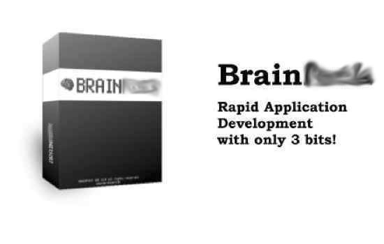

# 5 languages in 5 minutes
### Esoteric languages for your next project

---

<!-- .slide: data-background="#00AFFF" -->
## About me

* David Beitey
* @davidjb / @davidjb_
* Developer, Sys Admin, Enthusiast

---

 <!-- .element style="height: 200px" -->

# ArnoldC

Keywords and syntax are quotes from Schwarzenegger movies. (Java, not C)

---

~~~bash
LISTEN TO ME VERY CAREFULLY PYTHONISTAS
I NEED YOUR CLOTHES YOUR BOOTS AND YOUR MOTORCYCLE GUIDO
GIVE THESE PEOPLE AIR
GET TO THE CHOPPER GUIDO
HERE IS MY INVITATION GUIDO
GET UP 1
ENOUGH TALK
I'LL BE BACK GUIDO
HASTA LA VISTA, BABY

IT'S SHOWTIME
HEY CHRISTMAS TREE PYCON
YOU SET US UP 2016
TALK TO THE HAND "Farewell from PyCon AU"
TALK TO THE HAND PYCON
GET YOUR A** TO MARS PYCON
DO IT NOW PYTHONISTAS PYCON
TALK TO THE HAND "See you around in"
TALK TO THE HAND PYCON

YOU HAVE BEEN TERMINATED
~~~

---

## Output

~~~bash
$ arnoldc src/pycon.arnoldc
Farewell from PyCon AU
2016
See you around in
2017
~~~

---

## Exceptions

~~~
Exception in thread "main" org.parboiled.errors.ParsingException:
WHAT THE **** DID I DO WRONG:
Invalid input ''', expected ' ', '\t', Operand or '"' (line 11, pos 18):
TALK TO THE HAND 'true'
        at org.arnoldc.ArnoldParser.parse(ArnoldParser.scala:203)
        at org.arnoldc.ArnoldGenerator.generate(ArnoldGenerator.scala:10)
        at org.arnoldc.ArnoldC$.main(ArnoldC.scala:21)
        at org.arnoldc.ArnoldC.main(ArnoldC.scala)
~~~
<!-- .element class="wrap" -->

---

## Why use it

* Good documentation
* Video links to look up quotes
* Decent debugging
* You *are* Arnold Schwarzenegger

---

## Why not

*  <!-- .element class="plain middle" style="height: 150px" -->
* `Else` statements aren't kid-friendly
* No comment syntax: `# Awww`
* Only has 16-bit signed int variables (!!)
* No less-than operator
* It's written in Java
* Hard to install

---

 <!-- .element style="height: 150px"-->

# TrumpScript

Language based upon speeches, political propaganda and more centred on Donald
Trump.

---

~~~
Thank you very much
It is great to be "here"
Let me say that "PyCon AU is nearly done"

This year is "2016"
Next year is "2017"
Please tell us we will "see you soon, in "; say next year?
Make next year "great" again
Bigger and better than it was before!

Go forward and work together with any language or cloud
America is great.
~~~
<!-- .element class="wrap" -->

---

## No ❤️ Mac

~~~
Traceback (most recent call last):
  File "./langs/TrumpScript/src/trumpscript/main.py", line 30, in <module>
    main()
  File "./langs/TrumpScript/src/trumpscript/main.py", line 24, in main
    Utils.verify_system(args.Wall)
  File "/Users/david1/dev/esoterica/langs/TrumpScript/src/trumpscript/utils.py", line 34, in verify_system
    Utils.boycott_apple()
  File "/Users/david1/dev/esoterica/langs/TrumpScript/src/trumpscript/utils.py", line 72, in boycott_apple
    raise Utils.SystemException('boycott');
  File "/Users/david1/dev/esoterica/langs/TrumpScript/src/trumpscript/utils.py", line 21, in __init__
    raise Exception(random.choice(ERROR_CODES[msg_code]))
Exception: Mac? 'Boycott all Apple products ... [censored]'
~~~
<!-- .element class="wrap" -->

---

## Output

~~~bash
$ TRUMP src/pycon.ts
PING alibaba.cn (140.205.248.2): 56 data bytes
64 bytes from 140.205.248.2: icmp_seq=0 ttl=14 time=330.005 ms

--- alibaba.cn ping statistics ---
1 packets transmitted, 1 packets received, 0.0% packet loss
round-trip min/avg/max/stddev = 330.005/330.005/330.005/0.000 ms
PING facebook.com (173.252.91.4): 56 data bytes
64 bytes from 173.252.91.4: icmp_seq=0 ttl=74 time=358.766 ms

--- facebook.com ping statistics ---
1 packets transmitted, 1 packets received, 0.0% packet loss
round-trip min/avg/max/stddev = 358.766/358.766/358.766/0.000 ms

pycon au is nearly done
we'll see you soon, in
2017
~~~

---

## Why use it

* Write programs in common language
* Easily mix in comments (ignores non-keywords)
* Written in Python!
* You *are* Donald Trump

---

## Why not

* Doesn't agree with ArnoldC (or any minorities)
* No Windows support (Trump is non-PC)
* No Mac support (Trump boycotts Apple)
* No i18n (American English only)

---

# LOLCode

I can haz Internet memes as syntax.

---

~~~
OBTW PYCON_AU 2016!
     long comments FTW TLDR
HAI 1.2
  CAN HAS STDIO?
  I HAS A TODAY, TODAY R 2016
  I HAS A PYCON_AU, PYCON_AU R NOOB
  VISIBLE "Future Year? "
  GIMMEH PYCON_AU, PYCON_AU IS NOW A NUMBR

  DIFFRINT PYCON_AU AN SMALLR OF PYCON_AU AN TODAY
  O RLY?
    YA RLY
      I HAS A YEARZ, YEARZ R DIFF OF PYCON_AU AN TODAY
      I HAS A DAYZ, DAYZ R -2
      IM IN YR LOOPZ
        YEARZ R DIFF OF YEARZ AN 1
        DAYZ R SUM OF DAYZ AN 365
        BOTH SAEM 0 MOD OF YEARZ AN 4, O RLY?, YA RLY, DAYZ R SUM OF DAYZ AN 1, OIC
        BOTH SAEM YEARZ AN 0, O RLY?, YA RLY, GTFO, OIC
      IM OUTTA YR LOOPZ
      VISIBLE SMOOSH "ZOMG PyCon AU " PYCON_AU " starting in... :)" MKAY
      VISIBLE DAYZ " days! Getz ready!"
    NO WAI
      VISIBLE "Later year pls. KTHXBAI."
  OIC
KTHXBYE
~~~
<!-- .element class="wrap" -->

---

## Output

~~~bash
$ lci src/pycon.lols
lci src/pycon.lols
Future Year?
2050
ZOMG PyCon AU 2050 starting in approx...

12417 days! Getz ready!
~~~

---

## Why use it

* Uses Gen-Y natural language
* Versioned spec docs (!!)
* Whitespace indenting

---

## Why not

* No dates
* `NUMBR` vs `NUMBAR`
* `IM IN YR LOOPZ UPPIN/NERFIN` don't work yet
* Meanwhile in Python:

~~~python
from datetime import datetime
print('%s days til PyCon AU!' % (datetime(int(input('Future Year? ')), 8, 13) - datetime.now()).days)
~~~
<!-- .element class="wrap" -->

---

# Brain****

BF. Mind-melding. Likely the most well-known esolang.

---

Increment `+`    Decrement `-`

Move pointer left/right `< >`

While loop `[]` ;  Print `.` ; Input `,`

~~~brainfuck
++++++++++[>++++++++>++++++++++++>
+++++++>+++++++++++>+++++++++++>++
+>+++++++>+++++++++>+++>+++++>++++
+>+++++>+++++<<<<<<<<<<<<<-]>.>+.>
---.>+.>.>++.>-----.>-----.>++.>.>
--.>-.>++++.
~~~
<!-- .element class="wrap" -->

    PyCon AU 2016

---

## Why use it

* All other keys on keyboard are broken
* Semantic syntax

---

## Why not

* Accidental use of syntax in comments is easy
* Little hard to read
* No linter (yet?)

---

 <!-- .element style="height: 300px" -->

## Anguish

BF flavour written entirely in *invisible* Unicode characters;
(0-width!)

---

### Yes, there's a program there.

~~~
⁡⁡⁡⁡⁡ ⁡⁡⁡⁡⁡ ⁡⁡⁡⁡⁡ ⁡⁡⁡⁡⁡ ⁡⁡⁡⁡⁡ ⁡⁡⁡⁡⁡ ⁡⁡⁡⁡⁡ ⁡⁡⁡⁡⁡ ⁡⁡⁡⁡⁡ ⁡⁡⁡⁡⁡ ⁡⁡⁡⁡⁡ ⁡⁡⁡⁡⁡ ⁡⁡⁡⁡⁡ ⁡⁡⁡ ⁣ ⁡⁡⁡⁡⁡ ⁡⁡⁡⁡⁡ ⁡⁡⁡⁡⁡ ⁡⁡⁡⁡⁡ ⁡⁡⁡⁡⁡ ⁡⁡⁡⁡ ⁣ ⁡⁡⁡⁡ ⁡⁡⁡⁡⁡ ⁡⁡⁡⁡⁡ ⁡⁡⁡⁡⁡ ⁡⁡ ⁣ ⁢ ⁢ ⁢ ⁢ ⁢ ⁢ ⁢ ⁢ ⁢ ⁢ ⁢ ⁢ ⁢ ⁣ ⁢ ⁢ ⁢ ⁢⁢ ⁣ 
~~~

---

~~~
>   [⁠] U+2060 WORD JOINER [Cf]
<   [​] U+200B ZERO WIDTH SPACE [Cf]
+   [⁡] U+2061 FUNCTION APPLICATION [Cf]
-   [⁢] U+2062 INVISIBLE TIMES [Cf]
.   [⁣] U+2063 INVISIBLE SEPARATOR [Cf]
,   [] U+FEFF ZERO WIDTH NO-BREAK SPACE [Cf]
[   [‌] U+200C ZERO WIDTH NON-JOINER [Cf]
]   [‍] U+200D ZERO WIDTH JOINER [Cf]
~~~

---

## Output

~~~
David
~~~

* Typed by hand into Vim
* Lot of BF characters!

https://github.com/davidjb/esoterica/blob/master/src/david.anguish

---

## Why use it

* Hiding code / exploits
* You bought one of those Unicode-non-printable keyboards from Amazon and
  **FINALLY** have a use for it!

 <!-- .element style="height: 200px"-->

---

## Coming soon: Pyfection

Improving your code quality through rewriting

---

* Lint warnings **delete the code**
* Syntax errors **remove the interpreter**
* Uncaught exceptions **erase your drive**

---

# The only lang that makes you afraid to finish writing it™

---

## Have at it, PyCon AU

---

<!-- .slide: data-background="#00FF99" -->

# Thanks!

Code and slides @
https://github.com/davidjb/esoterica

@davidjb_ / [davidjb.com](http://davidjb.com)

From North Queensland?
<http://www.meetup.com/dev-nq/>

